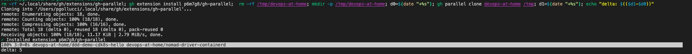
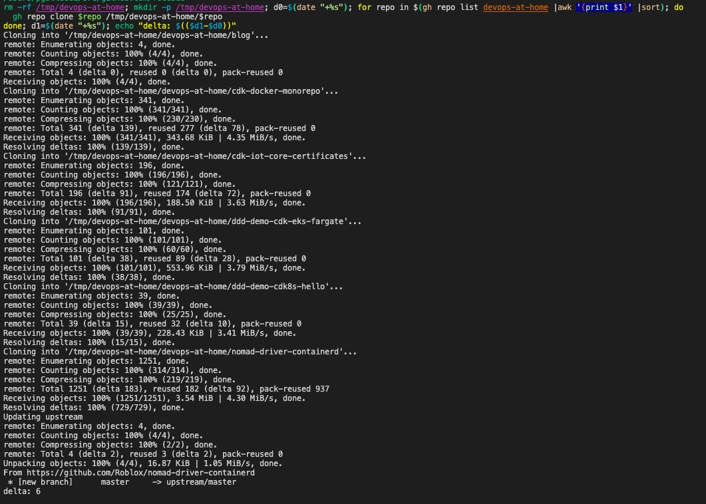

# gh-parallel

## Table of Contents


### gh-parallel
- [gh-parallel](#gh-parallel)
  - [Table of Contents](#table-of-contents)
    - [gh-parallel](#gh-parallel-1)
    - [Badges](#badges)
  - [Summary](#summary)
  - [Usage](#usage)
  - [Contributing](#contributing)
  - [Code of Conduct](#code-of-conduct)
  - [Changes](#changes)
  - [Author](#author)
  - [Contributors ✨](#contributors-)

### Badges

[](https://opensource.org/licenses/Apache-2.0)
[](https://gitpod.io/#https://github.com/p6m7g8/gh-parallel)
[](https://mergify.io)
[](https://codecov.io/gh/p6m7g8/gh-parallel)
[](https://snyk.io/test/github/p6m7g8/gh-parallel?targetFile=package.json)
[](https://github.com/p6m7g8/gh-parallel/network/dependents?dependent_type=REPOSITORY)
[](https://github.com/p6m7g8/gh-parallel/network/dependents?dependent_type=PACKAGE)
<!-- ALL-CONTRIBUTORS-BADGE:START - Do not remove or modify this section -->
[](#contributors-)
<!-- ALL-CONTRIBUTORS-BADGE:END -->

## Summary

After:


Before:


This requires `gnu parallel` to be installed. Which it will then make use of to parallelize clone and sync requests.

This is quite useful to clone organizations faster and or a list of disparate repositories.

## Usage

```shell
Usage:
  gh parallel -h
  gh parallel list [<login> [-- <list options>] | -h]
  gh parallel clone [<login> <dest_dir> [-- <clone options] | -h]
```

## Contributing

- [How to Contribute](CONTRIBUTING.md)

## Code of Conduct

- [Code of Conduct](https://github.com/p6m7g8/.github/blob/master/CODE_OF_CONDUCT.md)

## Changes

- [Change Log](CHANGELOG.md)

## Author

Philip M . Gollucci <pgollucci@p6m7g8.com>

## Contributors ✨

Thanks goes to these wonderful people ([emoji key](https://allcontributors.org/docs/en/emoji-key)):

<!-- ALL-CONTRIBUTORS-LIST:START - Do not remove or modify this section -->
<!-- prettier-ignore-start -->
<!-- markdownlint-disable -->
<table>
  <tr>
    <td align="center"><a href="http://pgollucci.github.io/"><br /><sub><b>Philip M. Gollucci</b></sub></a><br /><a href="https://github.com/p6m7g8/gh-parallel/commits?author=pgollucci" title="Code">💻</a></td>
  </tr>
</table>

<!-- markdownlint-restore -->
<!-- prettier-ignore-end -->

<!-- ALL-CONTRIBUTORS-LIST:END -->

This project follows the [all-contributors](https://github.com/all-contributors/all-contributors) specification. Contributions of any kind welcome!